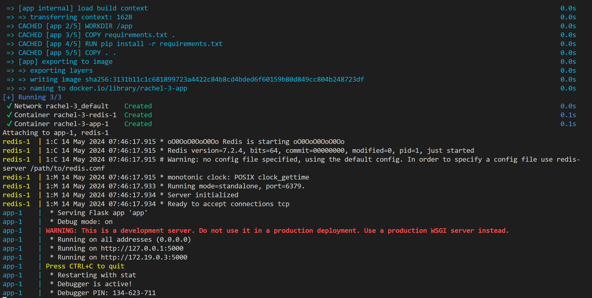

# To-Do List App

## 소개
투두 리스트 앱은 사용자가 할 일 목록을 쉽게 작성하고 관리할 수 있는 웹 애플리케이션이다. 사용자는 텍스트 입력란에 할 일을 입력하고 추가 버튼을 클릭하여 목록에 추가할 수 있다. 저장된 항목은 화면에 리스트 형태로 표시되며, 사용자는 각 항목을 삭제할 수 있다.

## 주요 기능
- 할 일 항목 작성 및 저장
- 저장된 항목의 목록 표시
- 항목 삭제

## 실행 방법
Docker Compose를 사용하여 이 애플리케이션을 쉽게 설정하고 실행할 수 있다.

### Docker Compose를 사용하여 실행
1. 프로젝트 디렉토리에서 다음 명령을 사용하여 Docker Compose를 실행한다.
   ```bash
   docker-compose up --build
   ```
   이 명령은 필요한 모든 서비스를 시작한다.
   

2. 웹 브라우저에서 `http://localhost:5000`으로 접속하여 애플리케이션을 사용한다.

### Docker Compose 내리기
실행 중인 모든 서비스를 중지하고 관련 Docker 컨테이너를 제거하려면 다음 명령을 사용하면 된다.
   ```bash
   docker-compose down
   ```
   

## 애플리케이션 사용 화면
### 1. 앱 실행 메인 화면
- 사용자가 처음 앱을 실행했을 때 나타나는 화면이다. 사용자는 여기에서 새로운 할 일을 입력할 수 있다.
  

### 2. 투두리스트 추가 화면
- 사용자가 투두 리스트에 할 일을 추가한 후의 화면이다. 입력된 할 일이 리스트에 표시된다.
  

### 3. 할 일 완료 체크 화면
- 사용자가 할 일을 완료로 체크한 화면이다. 할 일 완료 여부를 쉽게 확인할 수 있다.
  

### 4. 마우스 오버 시 삭제 버튼 표시 화면
- 사용자가 마우스를 항목 위에 올렸을 때 나타나는 'X' 삭제 버튼이다. 이 버튼을 클릭하면 항목을 삭제할 수 있다.
  

### 5. 항목 삭제 후 화면
- 사용자가 할 일 항목을 삭제한 후의 화면이다. 삭제된 항목은 리스트에서 제거된다.
  

## 기술 스택
- **프론트엔드**: HTML, CSS, JavaScript
- **백엔드**: Python (Flask)
- **데이터베이스**: Redis
- **컨테이너화**: Docker, Docker Compose

## 참고
- 이 프로젝트는 Flask 프레임워크를 사용하여 개발되었습니다.
- Docker 및 Docker Compose를 통해 각 컴포넌트는 독립적으로 실행될 수 있으며, 개발 및 배포 과정을 단순화합니다.
- 프로젝트는 다양한 환경에서의 일관된 실행을 보장하기 위해 컨테이너화되었습니다.
- 프론트엔드 디자인은 HTML과 CSS, JavaScript를 사용하여 구현되었습니다. 
- Wanted Backend Challenge에 참여하며 contest 제출을 위해 제작된 파일입니다.