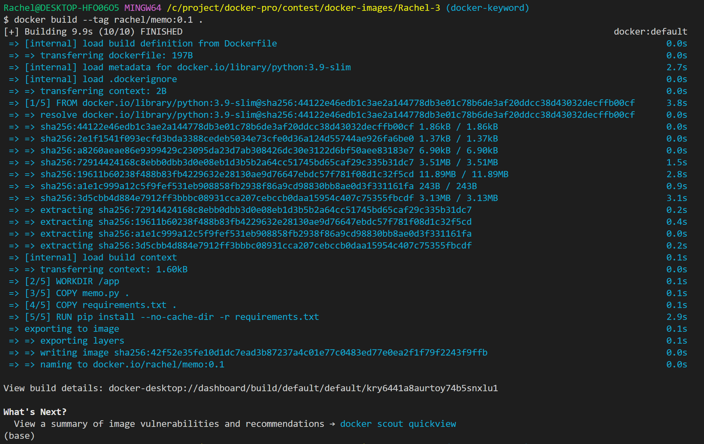
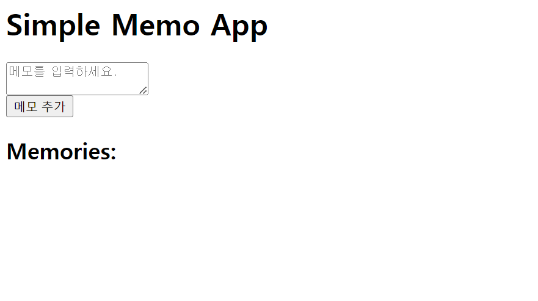
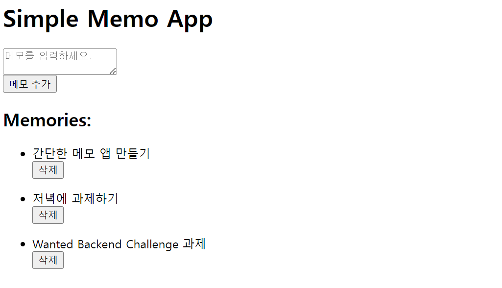

# Memo App

## 소개
메모 앱은 간단한 텍스트 메모를 작성하고 저장하는 데 사용되는 애플리케이션이다. 사용자는 텍스트 입력란에 메모를 작성하고 추가 버튼을 클릭하여 메모를 저장할 수 있다. 저장된 메모는 메모리 목록에 표시되어 사용자가 나중에 확인할 수 있다.

## 주요 기능
- 텍스트 메모 작성 및 저장
- 저장된 메모 목록 표시
- 저장된 메모 삭제

## 실행 방법
### Docker 이미지 빌드
1. 해당 프로젝트의 루트 디렉토리에서 다음 명령을 실행하여 Docker 이미지를 빌드한다.
   ```
   docker build --tag rachel/memo:latest .
   ```
   
2. 이미지 빌드가 완료되면 컨테이너를 실행한다.
   ```
   docker run -p 5000:5000 rachel/memo:latest
   ```
3. 웹 브라우저에서 `http://localhost:5000`을 연다.

### Docker Hub에서 이미지 받아오기
1. 다음 명령을 사용하여 Docker Hub에서 이미지를 가져온다.
   ```
   docker pull rachel/memo:latest
   ```
2. 이미지를 다운로드 한 후 컨테이너를 실행한다.
   ```
   docker run -d -p 5000:5000 rachel/memo:latest
   ```
3. 웹 브라우저에서 `http://localhost:5000`을 연다.




## 기술 스택
- Python (Flask)
- HTML
- CSS

## 참고
- 이 프로젝트는 Flask 프레임워크를 사용하여 개발되었습니다.
- 프론트엔드 디자인은 기본 HTML과 CSS를 사용하여 구현되었습니다.
- Wanted Backend Challenge에 참여하며 contest 제출을 위해 제작된 파일입니다.