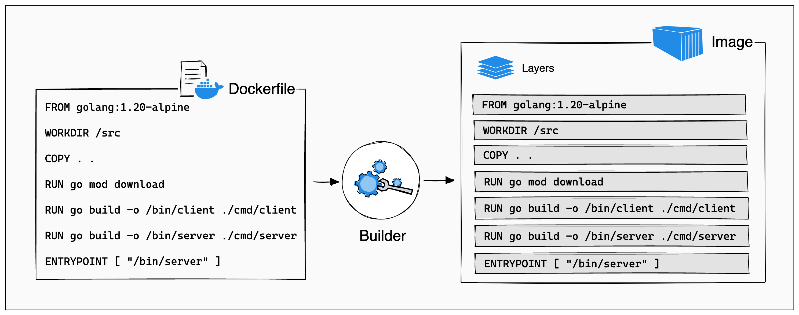
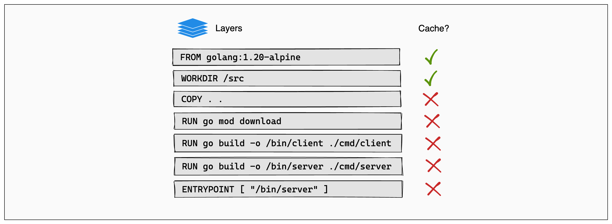
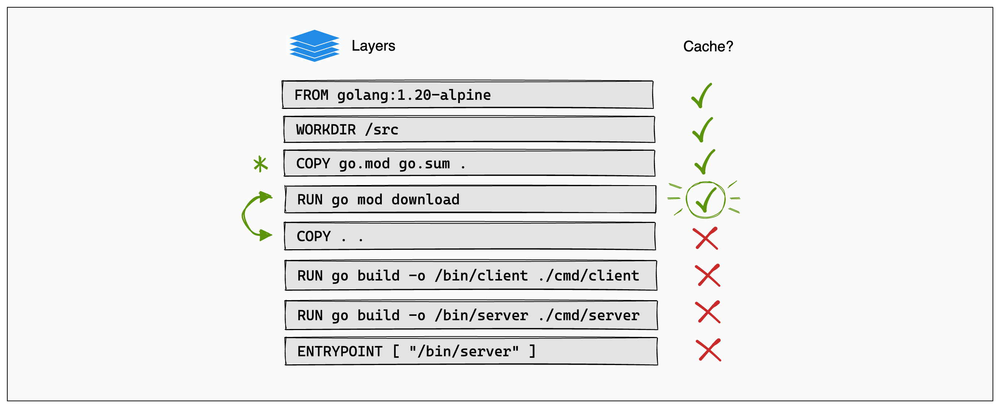

# 찾아보면 좋은 키워드
* 키워드 정리하기 : 도커 파일, 도커 이미지 레이어 구조
* 참고 공식 문서 : [도커 레이어](https://docs.docker.com/build/guide/layers/)
<br><br>

# 수업 내용에서 배운 기본적인 도커 사용법

도커와 컨테이너 기술에 대해 정리한 내용은 [이 문서를 참고하세요.](/mission/Rachel-3/mission.md)

도커의 기본적인 사용법에는 이미지 생성, 컨테이너 실행, 컨테이너 관리 등이 포함된다. 도커 CLI(Command Line Interface)를 통해 다음과 같은 명령어들을 사용할 수 있다.

수업시간에 사용한 명령어와 추가로 학습한 명령어를 간단하게 정리한 내용이다.

- `docker build` : Dockerfile에 기술된 지시에 따라 이미지를 빌드한다.
- `docker run` : 이미지를 바탕으로 새 컨테이너를 실행한다.
- `docker ps` : 실행 중인 컨테이너의 목록을 보여준다.
- `docker stop` : 실행 중인 컨테이너를 중지한다.
- `docker images` : 시스템에 있는 모든 도커 이미지의 목록을 보여준다. 각 이미지의 ID, 생성 시간, 크기 등이 포함된다.
- `docker pull` : 지정된 이름의 이미지를 Docker Hub나 다른 이미지 레지스트리에서 다운로드한다.
- `docker rmi` : 하나 또는 여러 이미지를 제거한다. 이미지가 컨테이너에서 사용 중이지 않을 때 제거할 수 있다.
- `docker exec` : 실행 중인 컨테이너에 명령을 보내 실행한다. 예를 들어, 실행 중인 컨테이너 내부에서 쉘을 시작하려면 `docker exec -it [컨테이너 ID 또는 이름] /bin/bash`를 사용할 수 있다.
- `docker logs` : 컨테이너의 로그를 표시한다. 이를 통해 컨테이너 실행 중 발생하는 이벤트를 추적할 수 있다.
- `docker network create` : 사용자 정의 네트워크를 생성하여 컨테이너 간의 통신을 설정한다.
- `docker volume create` : 데이터를 영구적으로 저장할 도커 볼륨을 생성한다. 이 볼륨은 컨테이너 사이에 공유될 수 있고, 컨테이너가 삭제되어도 데이터는 유지된다.
- `docker stats` : 모든 컨테이너의 실시간 리소스 사용량(메모리, CPU 등)을 보여준다.
- `docker system prune` : 사용하지 않는 도커 리소스(중지된 컨테이너, 사용되지 않는 이미지, 네트워크)를 정리하여 시스템을 정리한다.
<br><br><br>

# 도커 파일과 도커 이미지 레이어 구조

## 도커 파일(Dockerfile) 이란?

도커 파일은 도커 이미지를 빌드하기 위한 스크립트 파일로, 각 명령어는 이미지의 새로운 레이어를 만들고, 이 레이어들이 스택처럼 쌓여 최종 이미지를 형성한다. 도커 파일을 사용하여 이미지를 생성하는 과정은 매우 자동화되어 있으며, 이를 통해 어플리케이션 배포를 일관되고 예측 가능하게 만든다.

## 레이어(Layers)와 캐시

- **레이어** : 도커 이미지는 여러 개의 레이어로 구성되며, 각 레이어는 이전 레이어 위에 추가되는 변경사항들을 저장한다. 이는 이미지를 재구성할 때 필요한 데이터만 다시 다운로드하거나 수정하게 해준다.
- **캐시 활용** : 빌드 프로세스 중에 도커는 이전 빌드에서 사용되었던 레이어의 캐시를 재사용함으로써 빌드 시간과 자원을 절약할 수 있다. 변경되지 않은 레이어는 다시 다운로드하거나 빌드하지 않는다.

## Dockerfile 구조와 레이어 캐싱 이해

아래 이미지는 Dockerfile의 각 명령어가 어떻게 레이어를 형성하는지를 보여준다.



## 레이어 캐시의 중요성

도커 파일의 명령 순서가 중요한 이유는 레이어 캐시 때문이다. 레이어의 순서가 캐시 메커니즘에 크게 영향을 미치기 때문에, 도커 파일에서 명령어의 순서는 매우 중요하다. 잘못된 명령어 순서는 불필요한 레이어의 재빌드를 유발할 수 있어, 효율성과 속도를 저하시킨다. 예를 들어, 소스 코드 파일을 먼저 복사한 후 의존성 파일을 설치하면, 소스 코드에 변경이 생길 때마다 의존성 레이어도 재빌드해야 한다.

## 캐시 최적화 전략

다음 이미지는 캐시 최적화 전략의 중요성을 강조한다. 코드 변경에 따라 어떤 레이어가 캐시를 사용할 수 있는지 보여준다.



## 명령어 순서 최적화

명령어의 순서를 조정하여 의존성 파일(`go.mod`, `go.sum`)을 소스 코드 전체를 복사하기 전에 먼저 복사하고 설치함으로써, 소스 코드의 변경이 의존성 레이어에 영향을 주지 않게 할 수 있다. 이를 통해 불필요한 의존성 다운로드를 줄일 수 있다.

```dockerfile
# 최적화된 Dockerfile 예시
FROM golang:1.21-alpine
WORKDIR /src
COPY go.mod go.sum .
RUN go mod download
COPY . .
RUN go build -o /bin/client ./cmd/client
RUN go build -o /bin/server ./cmd/server
ENTRYPOINT ["/bin/server"]
```

## 최적화된 Dockerfile 예시

최적화된 Dockerfile 구조를 설명하는 이미지이다. 의존성 파일을 먼저 복사하고, 필요한 컴파일 작업을 수행하는 순서를 보여준다.



## 요약

도커 파일의 명령어 순서를 최적화함으로써 빌드 시간을 단축하고 불필요한 작업을 줄일 수 있다. 이러한 방식은 레이어의 재사용을 최대화하여 효율적으로 리소스를 관리할 수 있게 도와준다.

## 관련 정보

- [도커 빌드 캐시](https://docs.docker.com/develop/develop-images/dockerfile_best-practices/#leverage-build-cache)
- [도커 파일 베스트 프랙티스](https://docs.docker.com/develop/develop-images/dockerfile_best-practices/)