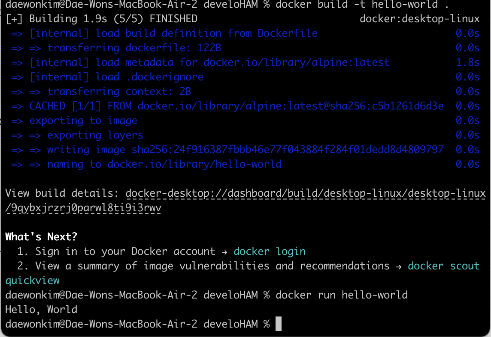

# **사전 미션**

1. ### 컨테이너 기술이란 무엇입니까? (100자 이내로 요약)\*\*
    - 애플리케이션과 애플리케이션의 종속성을 포함하는 완전한 실행 환경을 제공하는 패키지.
    - 격리된 환경에서 실행되며, 운영 체제 및 환경과 독립적으로 일관된 동작을 보장.
    - 호스트 운영 체제의 커널을 공유하므로 가벼운 격리가 이루어지고, 이를 통해 더 빠르고 효율적으로 실행이 가능

---

2. ### **도커란 무엇입니까? (100자 이내로 요약)**
    - 컨테이너화 기술을 이용하여 소프트웨어 애플리케이션을 패키징하고 실행하는 플랫폼
    - 개발자와 시스템 관리자가 애플리케이션을 쉽게 빌드, 배포, 및 실행할 수 있도록 도와주는 오픈 소스 프로젝트

---

3. ### **도커 파일, 도커 이미지, 도커 컨테이너의 개념은 무엇이고, 서로 어떤 관계입니까?**
    - 도커 파일(Dockerfile):
        - 컨테이너 이미지를 만들기 위한 명령어 스크립트 (설정파일)
        - 컨테이너를 구성하는데 필요한 모든 설정 및 명령을 정의함.
        - 도커 파일에는 베이스 이미지, 소스 코드 복사, 의존성 설치, 환경 변수 설정 등의 작업이 포함될 수 있음.
    - 도커 이미지 (Docker Image):
        - 도커 파일에 정의된 명령을 실행하여 만들어진 응용 프로그램의 실행 가능한 패키지.
        - 컨테이너를 실행하는 데 필요한 모든 것(애플리케이션 코드, 런타임, 라이브러리, 환경 설정 등)이 포함됨.
        - 불변성을 가지며 읽기 전용이므로, 한 번 생성된 이미지는 변경되지 않음.
    - 도커 컨테이너 (Docker Container):
        - 도커 이미지의 실행 가능한 인스턴스
        - 격리된 환경에서 애플리케이션을 실행하며, 호스트 시스템과는 격리되어 있음.
        - 이미지를 기반으로 생성되고, 컨테이너가 종료되면 기본적으로 변경 사항이 저장되지 않고 삭제되나, Docker 볼륨(volume)을 사용하여 변경 사항 데이터를 호스트 머신에 저장할 수 있음.

---

4. ### **[실전 미션] 도커 설치하기**
    
