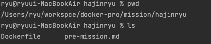
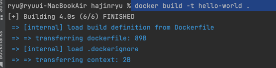
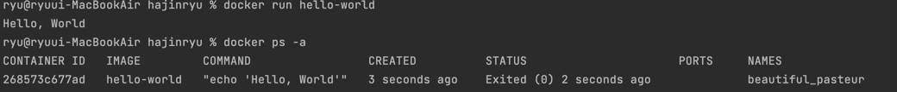

1. 컨테이너 기술이란 무엇입니까?

컨테이너 기술은 애플리케이션을 패키지화하고 실행하는 기술
애플리케이션을 실행하는 데 필요한 모든 것을 포함한 독립적인 환경을 제공합니다. 
이는 가상화 기술을 이용하여 격리된 환경에서 애플리케이션을 실행하므로 애플리케이션 간의 충돌을 방지하고 이식성을 향상시킵니다.

2. 도커란 무엇입니까?

도커는 컨테이너 기술을 구현하고 관리하는 플랫폼으로, 
애플리케이션을 컨테이너로 패키지화하고 배포하기 위한 도구를 제공합니다. 
도커는 애플리케이션의 이식성을 높이고 개발 및 배포 프로세스를 간소화하는 데 사용됩니다.

3. 도커 파일, 도커 이미지, 도커 컨테이너의 개념은 무엇이고, 서로 어떤 관계입니까?

도커 파일은 도커 이미지를 만들기 위한 명령어 스크립트이며,
도커 이미지는 애플리케이션 실행에 필요한 모든 것을 포함한 패키지입니다.
도커 컨테이너는 도커 이미지를 실행한 인스턴스로, 도커 이미지를 기반으로 생성되며 애플리케이션을 실행하는 격리된 환경을 제공합니다. 

[추가 참조](https://github.com/drum-grammer/docker-pro-2308/issues?q=label%3A%22%F0%9F%91%8D+%EA%B0%84%EA%B2%B0+%EC%A0%95%ED%99%95%22+is%3Aclosed)

4. 도커 컨테이너 실행화면
- 도커 파일이 존재하는 위치에서 이미지 생성
 

- 도커 이미지 실행 결과
