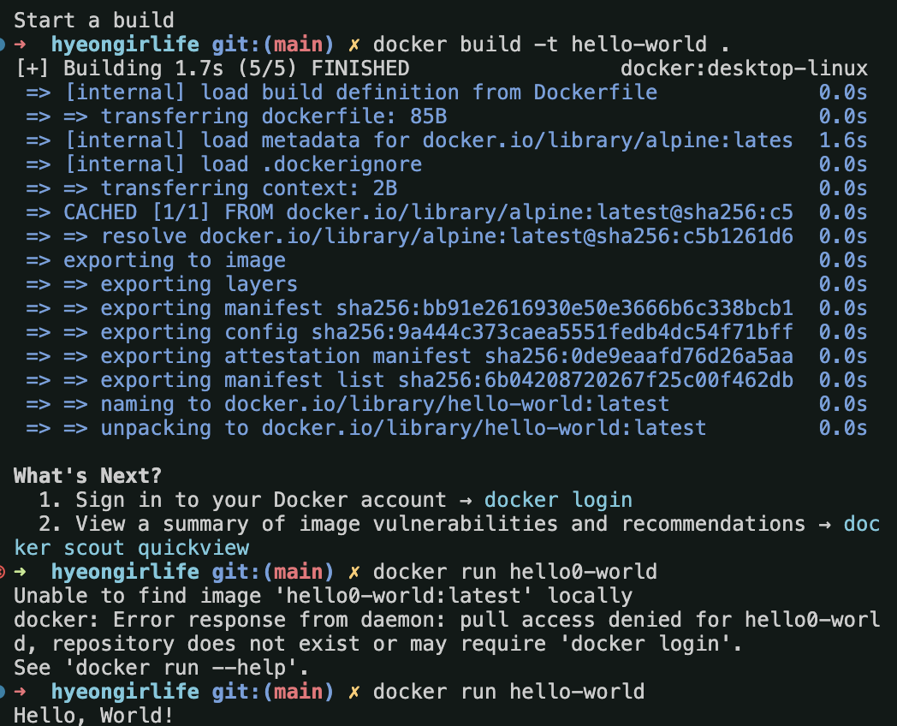

1. 컨테이너 기술이란 무엇입니까? (100자 이내로 요약)
- **컨테이너 기술**은 애플리케이션을 격리된 환경에 패키징하여 이식성과 확장성을 높이는 기술이다.

2. 도커란 무엇입니까? (100자 이내로 요약)
- **도커**는 컨테이너 기술을 이용하여 애플리케이션을 개발, 배포, 실행할 수 있는 플랫폼이다.

3. 도커 파일, 도커 이미지, 도커 컨테이너의 개념은 무엇이고, 서로 어떤 관계입니까?
- **도커 파일**은 애플리케이션 설정과 종속성을 정의하는 스크립트이다. **도커 이미지**는 이 파일을 기반으로 빌드된 실행 가능한 패키지이며, **도커 컨테이너**는 이미지의 인스턴스로서 실행되는 격리된 환경이다.

4. [실전 미션] 도커 설치하기
